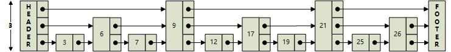
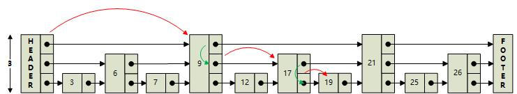
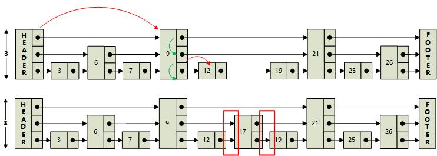
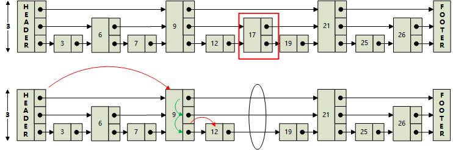

## 简介

SkipList(跳跃表)这种数据结构是由William Pugh于1990年在 Communications of the ACM June 1990, 33(6) 668-676 发表的，“Skip lists: a probabilistic alternative to balanced trees”，在其中详细描述了他的工作。由论文标题可知，SkipList的设计初衷是作为替换平衡树的一种选择。

我们都知道，AVL树有着严格的O(logN)的查询效率，但是由于插入过程中可能需要多次旋转，导致插入效率较低，因而才有了在工程界更加实用的红黑树。

但是红黑树有一个问题就是在并发环境下使用不方便，比如需要更新数据时，SkipList需要更新的部分比较少，锁的东西也更少，而红黑树有个平衡的过程，在这个过程中会涉及到较多的节点，需要锁住更多的节点，从而降低了并发性能。

SkipList还有一个优势就是实现简单。

时隔将近三十多年，SkipList这种数据结构仍在许多途径有用武之地，比如Redis, 还有Google的著名项目Bigtable.

## 原理及实现

其实跳跃表就是在普通单向链表的基础上增加了一些索引，而且这些索引是分层的，从而可以快速地查的到数据。如下是一个典型的跳表:




### 查找

查找示意图如下:



整个查找逻辑是**从头节点的最高level开始，判断右边的节点，如果大了就往下，如果小了就往右，只到相等或者到了尾结点为止**。

比如我们要查找key为19的结点，那么我们不需要逐个遍历，而是按照如下步骤:

- 从header节点出发，从最高层（第3层）开始，判断右边的节点，发现9 < 19，就往右，到了9这个节点。
- 判断当前节点（9）当前level（3）右边的节点，由于21 > 19, 所以不再往右，而是往下，level由3降低到2。
- 判断当前节点（9）当前level（2）右边的节点，由于17 < 19, 所以继续往右，到了17这个节点。
- 判断当前节点（17）当前level（2）右边的节点，发现21>19, 所以level由2降低到1。
- 判断当前节点（17）当前level（1）右边的节点，发现19==19，查找完毕。
- 如果在level==1这层没有查找到（到了尾结点），那么说明不存在key为19的节点，查找失败。


如下是C++实现：
```
template<typename SortField, typename Value>
const Node<SortField, Value>* SkipList<SortField, Value>::find(const SortField& sort_field, int* rank) const {
	if (rank != nullptr)
		*rank = 1;
	auto node = header_;
	for (int i = max_level_ - 1; i >= 0; --i) {
		//找到目标节点的前节点
		while (node->level_[i].forward != footer_ &&
		node->level_[i].forward->sort_field_ < sort_field) {
			if (rank != nullptr)
				*rank += node->level_[i].span;
			node = node->level_[i].forward;
		}
	}

	//如果该跳跃表为空，头节点就会直接指向尾节点
	if (node == footer_)
		return nullptr;
	node = node->level_[0].forward;
	if (node == footer_)
		return nullptr;
	if (node->sort_field_ != sort_field)
		return nullptr;
	return node;
};
```


### 插入

如下是插入结点示意图:



插入节点首先要找到插入位置，还是按照查找的逻辑，从头节点最高层开始，看右边如果小了就往右，如果大了就往下，一直到第1层走不动了或者碰到尾结点为止。

插入节点的过程如下:

- 查找合适的插入位置，比如上图中要插入key为17的结点，就需要一路查找到12,由于12 < 17,而12的下一个结点19 > 17,因而满足条件
- 创建新结点，并且产生一个在1~MAX_LEVEL之间的随机level值作为该结点的level
- 调整指针
- 调整跨度


新节点的高度基于这样一种算法：

- 1/2的概率只有1层
- 1/4的概率有2层
- 1/8的概率有3层
- 1/16的概率有4层
- 以此类推，直到达到最高层数（在本组件中为32层）或者当前跳跃表最高层数+1为止。


插入的代码如下:

```cpp
template<typename SortField, typename Value>
bool SkipList<SortField, Value>::insert(const SortField& sort_field, const Value& value) {
	Node<SortField, Value>* update[MAX_LEVEL];
	int span[MAX_LEVEL];

	auto node = header_;
	for (int i = max_level_ - 1; i >= 0; --i) {
		//span[i-1]用来记录第i层达到插入位置的跨度,也是该层最接近(小于)给定score的排名
		//span[i-1]初始化为上一层所跨越的节点总数,因为上一层已经加过
		span[i] = (i == (max_level_ - 1) ? 0 : span[i+1]);

		while (node->level_[i].forward != footer_ &&
		node->level_[i].forward->sort_field_ < sort_field) {
			span[i] += node->level_[i].span;
			node = node->level_[i].forward;
		}
		update[i] = node;
	}

	node = node->level_[0].forward;

	//如果key已存在
	if (node != footer_ && node->sort_field_ == sort_field) {
		return false;
	}

	auto newNode = CreateNode(sort_field, value);
	if (newNode->node_level_ > max_level_) {
		//每次最多增加一层
		max_level_ = newNode->node_level_;
		span[max_level_ - 1] = 0;
		update[max_level_ - 1] = header_;
		update[max_level_ - 1]->level_[max_level_ - 1].span = size();
	}

	//调整forward指针
	for (int i = 0; i < newNode->node_level_ ; ++i) {
		node = update[i];
		newNode->level_[i].forward = node->level_[i].forward;
		node->level_[i].forward = newNode;

		newNode->level_[i].span = node->level_[i].span - (span[0] - span[i]);
		node->level_[i].span = span[0] - span[i] + 1;
	}

	for (int i = max_level_ - 1; i >= newNode->node_level_; --i) {
		update[i]->level_[i].span++;
	}

	++node_count_;
	return true;
};
```


### 移除

移除结点的示意图如下:



移除结点分为以下几个步骤：

- 从最高层开始一直到第一层，查找指定的结点，并且记录查找路径
- 调整指针指向
- 调整跨度
- 释放结点空间
- 如果有必要的话，调整最高层数

代码如下:
``` cpp
template<typename SortField, typename Value>
bool SkipList<SortField, Value>::remove(const SortField& sort_field) {
	//保存的是要删除的前一个节点
	Node<SortField, Value>* update[MAX_LEVEL];
	auto node = header_;
	for (int i = max_level_ - 1; i >= 0; --i) {
		while (node->level_[i].forward != footer_ &&
		node->level_[i].forward->sort_field_ < sort_field) {
			node = node->level_[i].forward;
		}
		update[i] = node;
	}

	if (node == footer_)
		return false;
	node = node->level_[0].forward;
	if (node == footer_)
		return false;
	//如果节点不存在
	if (node->sort_field_ != sort_field) {
		return false;
	}

	//现在node已经被找到，将要被删除，
	for (int i = 0; i <= max_level_ - 1; ++i) {
		if (update[i]->level_[i].forward != node) {
			//跳过了将要被删除的节点，所以跨度直接-1就好
			update[i]->level_[i].span--;
		} else {
			//连接着将要被删除的节点，需要改一下指针，更新一下跨度
			update[i]->level_[i].forward = node->level_[i].forward;
			update[i]->level_[i].span += (node->level_[i].span - 1);
		}
	}
	delete node;

	//更新max_level_的值，因为有可能在移除一个节点之后，max_level_值会发生变化，
	//及时降低可提高性能
	while (max_level_ > 0 &&
	header_->level_[max_level_ - 1].forward == footer_) {
		//如果头结点连着尾节点，这个高度是浪费的
		--max_level_;
	}

	--node_count_;
	return true;
};
```


